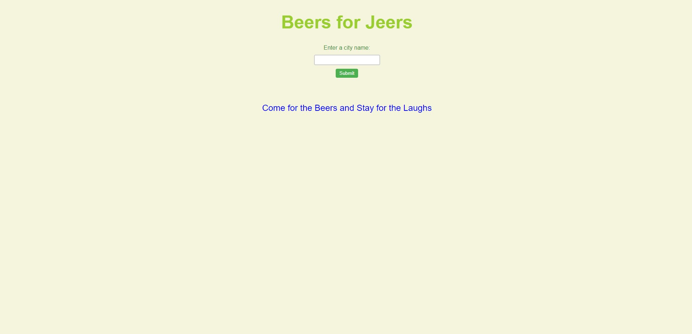
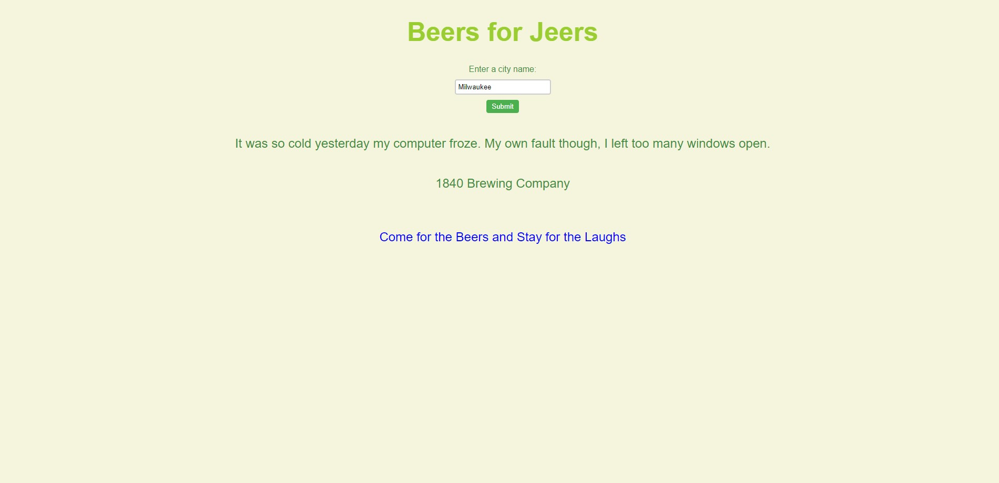

# Beers 4 Jeers
A simple app using 2 APIs to give you a lovely pairing of a brewery, and a cringe-worthy dad joke.

## Due Date
Projects are due at the end of class on Tuesday, March 14th.

## Group Members
* Ryan Pinkston
* Gary Henley
* Jon Schuh

## Tasks
- [x] Create a working agreement
- [x] Brainstorm app ideas
- [x] Create GitHub work space
- [x] Design app wireframe
- [x] Design app

## Technologies
Our app was created using

    * HTML
    * JavaScript
    * Css
    * Google Fonts
    * Local Storage

## Function
When you use the search function on the app to search for a city, it will pull from 2 seperate APIs to provide a pairing of a random brewery in the city, as well as a random, (appropriate), dad joke.

## Goals
There were multiple goals that we as a group were focused on during the process of building the app. The first was, obviously, to streamline our working process as a team to complete our app within time restraints. The second was to learn how to work in an enterprise setting within GitHub and deal with merging conflicts, using proper working branches, managing even workload, and consistantly reviewing eachothers code work.

# App Example

## Links
Organization Repo Link : https://github.com/Beers-for-Jeers-III

GitHub Pages Link: https://beers-for-jeers-iii.github.io/dad-joke-pairings/

